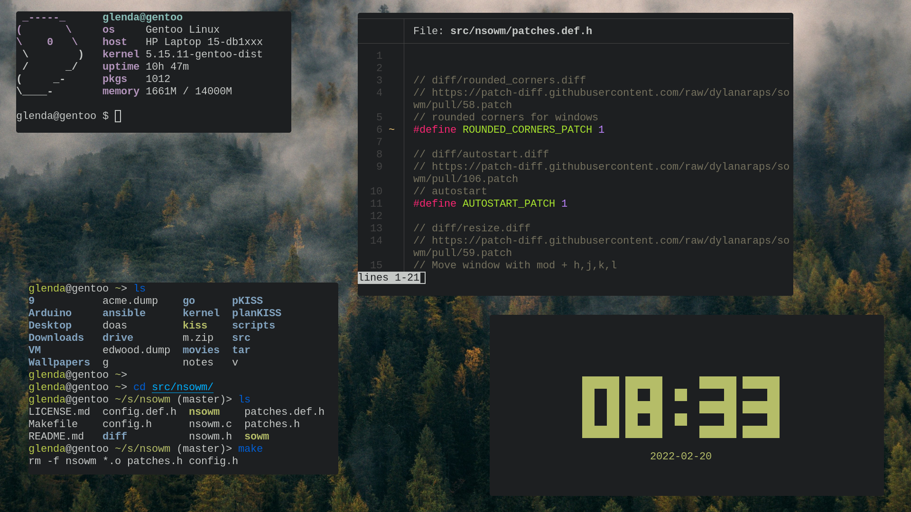
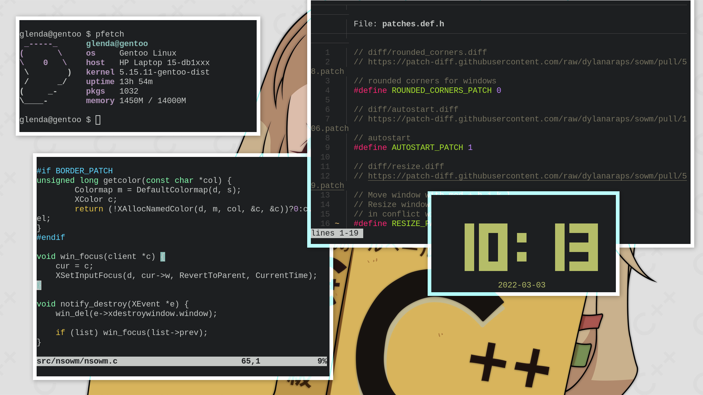

# nsowm (neo *~~Simple~~ Shitty Opinionated Window Manager*)

The next genergation of sowm

- Floating only.
- Fullscreen toggle.
- Window centering.
- Mix of mouse and keyboard workflow.
- Focus with cursor.
- Rounded corners (patch)
- Titlebars (patch)
- lemonbar support (barfs)

- Alt-Tab window focusing.
- All windows die on exit.
- Window borders (patch).
- [No ICCCM](https://web.archive.org/web/20190617214524/https://raw.githubusercontent.com/kfish/xsel/1a1c5edf0dc129055f7764c666da2dd468df6016/rant.txt).
- No EWMH.
- etc etc etc

 

Patches available here: https://github.com/dylanaraps/sowm/pulls

## Default Keybindings

**Window Management**

| combo                      | action                 |
| -------------------------- | -----------------------|
| `Mouse`                    | focus under cursor     |
| `MOD1` + `Left Mouse`      | move window            |
| `MOD1` + `Right Mouse`     | resize window          |
| `MOD1` + `f`               | maximize toggle        |
| `MOD1` + `c`               | center window          |
| `MOD1` + `Shift` + `c`     | kill window            |
| `MOD1` + `Shift` + `q`     | quit nsowm             |
| `MOD1` + `1-6`             | desktop swap           |
| `MOD1` + `Shift` +`1-6`    | send window to desktop |
| `MOD1` + `TAB` (*alt-tab*) | focus cycle            |

**Programs**

| combo                       | action           | program        |
| --------------------------- | ---------------- | -------------- |
| `MOD1` + `Shift` + `Return` | terminal         | `alacritty`    |
| `MOD4` + `d`                | dmenu            | `dmenu_run`    |
| `MOD4` + `p`                | scrot            | `scrot`        |
| `MOD4` + `w`                | wallpaper cycler | `bud`          |
| `XF86_AudioLowerVolume`     | volume down      | `amixer`       |
| `XF86_AudioRaiseVolume`     | volume up        | `amixer`       |
| `XF86_AudioMute`            | volume toggle    | `amixer`       |
| `XF86_MonBrightnessUp`      | brightness up    | `bri`          |
| `XF86_MonBrightnessDown`    | brightness down  | `bri`          |

## Dependencies

- `xlib` (*usually `libX11`*).

## Installation

1) Run `make` to build `nsowm`.
2) Copy it to your path or run `make install`.
    - `DESTDIR` and `PREFIX` are supported.
3) (Optional) Apply patches with the `patches.h` file.
4) (Optional) Edit your config with the `config.h` file.

If you are using GDM, run `make desktop` as root to copy the `nsowm.desktop` file in `/usr/share/xsessions/`. It is still recommended to start `nsowm` from `.xinitrc` or through
[your own xinit implementation](https://github.com/dylanaraps/bin/blob/dfd9a9ff4555efb1cc966f8473339f37d13698ba/x).

### Rebuilding
- Run `make clean install` as root.

## Thanks
- [dwm-flexipatch](https://github.com/bakkeby/dwm-flexipatch)
- [2bwm](https://github.com/venam/2bwm)
- [SmallWM](https://github.com/adamnew123456/SmallWM)
- [berry](https://github.com/JLErvin/berry)
- [catwm](https://github.com/pyknite/catwm)
- [dminiwm](https://github.com/moetunes/dminiwm)
- [dwm](https://dwm.suckless.org)
- [monsterwm](https://github.com/c00kiemon5ter/monsterwm)
- [openbox](https://github.com/danakj/openbox)
- [possum-wm](https://github.com/duckinator/possum-wm)
- [swm](https://github.com/dcat/swm)
- [tinywm](http://incise.org/tinywm.html)
