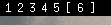

# Lemonbar

## Simple workpspace indicator
### Install of the included script
Run `make lemonbar` as root to install teh included lemonbar scripts. To launch lemonbar run `launchlemon`. The inclued lemonbar scripts are made of 3 scripts: `lemoncomfig`, `launchlemom` adn `ws_visualizer`. `lemonconfig` and `launchlemon` are written in posix shell, `ws_visualizer` in go.
#### `launchlemon`
`launchlemon` is a pretty simple script it just pipes `lemonconfig` in `lemonbar` 
#### `lemonconfig`
`lemonconfig` is the config of `lemonbar` it contains a while loop which prints the text displaied in `lemonbar` to the standard output.